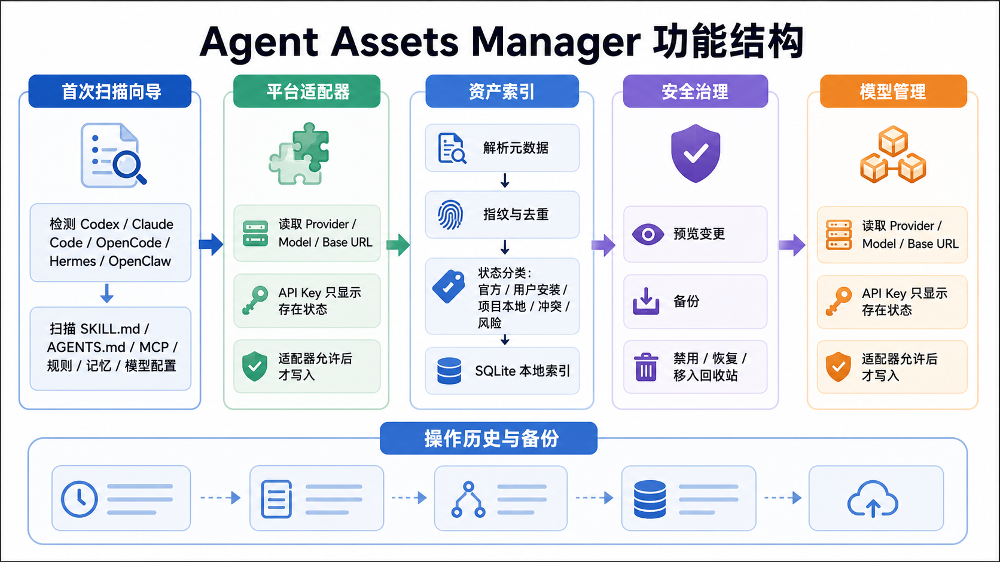
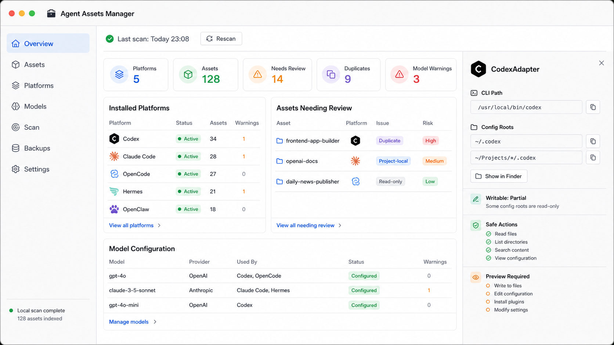

# Agent Assets Manager 前端与功能实现要求

Date: 2026-06-12
Updated: 2026-06-13

## 当前实现状态

本文件最初是交接给实现 Agent 的前端与功能要求。当前仓库已经完成一轮 P1/gap-closure 实现，后续工作应把本文档当成“已实现基线 + 延续约束”，而不是从零开始的需求草稿。

当前代码状态：

- 版本为 `0.1.3`。
- 技术栈已落地为 Tauri 2 + React 18 + TypeScript + Vite + Rust + SQLite + Tailwind CSS。
- 七个一级页面已存在：概览、资产、平台、模型、扫描、备份、设置。
- 首次扫描向导、扫描页、设置、模型配置、操作预览、备份记录已经接入 Tauri/Rust/SQLite 侧能力。
- 前端通过 `src/mappers/` 将后端 DTO 映射为 UI view model。
- 资产页已实现按资产类型/SKU 分组的卡片视图，保留右侧详情面板，支持平台图标、添加到全部平台、单平台目标选择、中文按钮文案。
- 平台图标改为生成式 PNG 资产，位于 `src/assets/platform-icons/`；Tauri 应用图标位于 `src-tauri/icons/`。
- 标题和紧凑标签已做不换行/截断处理，避免窄视口下中文 UI 撑开布局。
- 默认平台检测适配器包含 Codex、Claude Code、OpenCode、Hermes、OpenClaw、Kimi Code、Gemini CLI、Qwen Code、Cursor、Trae。
- `Generic CLI` 保留在平台模型和 adapter factory 中，但尚未进入默认检测列表。

## 目的

本文档用于交接给后续实现 Agent。目标不是重新定义产品，而是把 MVP 设计规格、功能结构图、原型界面图整理成可执行的前端与功能要求。

实现时必须参考：

- MVP 设计规格：[2026-06-12-agent-assets-manager-mvp-design.md](./2026-06-12-agent-assets-manager-mvp-design.md)
- 功能结构参考图：
- 原型界面参考图：

## 总体要求

Agent Assets Manager 是一个 Mac-first 本地桌面控制中心，用于发现、索引、治理 AI Agent 相关资产，并统一查看模型与 Provider 配置。

MVP 需要先做成一个真实可运行的桌面应用骨架，而不是营销页或静态展示页。首个可交付版本应支持本地扫描结果展示、平台与资产可视化、模型配置只读查看、安全状态提醒、操作预览入口。

推荐技术栈：

- Desktop shell: Tauri 2
- Frontend: React + TypeScript + Vite
- UI: Tailwind CSS 或小型本地组件系统
- Native core: Rust
- Storage: SQLite
- File operations: Rust filesystem layer

如实现 Agent 选择不同技术栈，必须说明理由，并保持同等能力：本地文件访问、SQLite、本地安全操作、Mac 桌面封装。

## 界面语言要求

除产品名、平台名、Provider 名、模型 ID、文件路径、命令名外，所有可见 UI 文案必须使用中文。

保留英文的内容：

- `Agent Assets Manager`
- `Codex`
- `Claude Code`
- `OpenCode`
- `Hermes`
- `OpenClaw`
- `Kimi Code`
- `Gemini CLI`
- `Qwen Code`
- `Cursor`
- `Trae`
- `Generic CLI`
- `OpenAI`
- `Anthropic`
- `OpenRouter`
- `Ollama`
- 模型 ID，例如 `gpt-4o`、`claude-3-5-sonnet`
- 文件名、路径、命令名，例如 `~/.codex`、`SKILL.md`、`AGENTS.md`

主要中文导航：

- 概览
- 资产
- 平台
- 模型
- 扫描
- 备份
- 设置

主要中文状态与动作：

- 上次扫描
- 重新扫描
- 本地扫描完成
- 已索引资产
- 需要检查
- 重复项
- 模型警告
- 已启用
- 只读
- 可写
- 部分可写
- 项目本地
- 风险
- 冲突
- 预览变更
- 创建备份
- 禁用
- 恢复
- 移入回收站
- 在 Finder 中显示

## 视觉与布局要求

原型方向以 `docs/assets/agent-assets-manager-ui-prototype.png` 为准，但实现版本必须改为中文界面。

整体风格：

- Mac 桌面工具感，而不是 SaaS 营销落地页。
- 浅色模式优先。
- 信息密度中高，但必须清晰、可扫读。
- 使用真实应用布局：左侧导航、顶部扫描状态、主内容区、右侧详情面板。
- 卡片圆角不超过 8px。
- 避免巨型 hero、装饰性渐变、嵌套卡片、过度插画和无意义徽章。
- 表格、列表、状态 badge、右侧 inspector 是核心信息载体。

主窗口布局：

- 顶部 Mac window chrome，可模拟红黄绿窗口按钮。
- 左侧固定导航栏，显示产品名与 7 个主导航。
- 顶部状态条显示最近扫描时间、扫描状态、重新扫描按钮。
- 中央区域显示当前页面内容。
- 右侧详情面板用于展示当前选中平台、资产或模型配置详情。

响应式要求：

- MVP 主要面向桌面，优先适配 1280px 以上宽度。
- 1024px 宽度下不能出现横向溢出。
- 右侧详情面板在窄屏下可折叠或下移。
- 表格在窄屏下可横向滚动，但导航和主要操作不能被遮挡。

## 信息架构

MVP 必须包含以下一级页面。

### 概览

概览是默认首页，参考原型图。

必须展示：

- 扫描状态：上次扫描时间、是否完成、资产索引数量。
- 关键指标：平台数、资产数、需要检查、重复项、模型警告。
- 已安装平台列表：平台名、状态、资产数、警告数。
- 需要检查的资产列表：资产名、平台、问题、风险等级。
- 模型配置摘要：模型、Provider、使用平台、状态、警告数。
- 右侧详情面板：默认展示 CodexAdapter 或当前选中的平台适配器。

概览首版可以使用 mock 数据，但结构必须和后续真实扫描数据对齐。

### 资产

资产页用于管理归一化后的 Agent 资产。

必须支持筛选：

- 全部
- Skills
- Agents
- Commands
- MCP
- Models
- 需要检查
- 重复项
- 冲突
- 风险
- 项目本地

资产卡片或列表必须展示：

- 名称
- 类型
- 描述
- 来源平台
- 安装矩阵
- 状态标签
- 风险标签
- 最后修改时间
- 操作入口

当前实现应优先维护卡片视图：

- 按资产类型/SKU 分组，不混排不同类型资产。
- 保留列表视图作为高密度查看方式。
- 卡片内展示平台安装目标，使用平台 PNG 图标。
- 提供添加到全部平台与单平台选择入口。
- 右侧详情面板继续展示当前资产详情与安装/同步动作。

### 平台

平台页用于查看各 Agent 工具的本地安装与适配器状态。

每个平台必须展示：

- 平台名
- CLI 路径
- 版本号，如可检测
- 配置根目录
- 支持的资产类型
- 已发现资产数
- 可写状态：可写、只读、部分可写
- 模型/Provider 配置摘要
- 安全操作能力

当前默认检测平台：

- Codex
- Claude Code
- OpenCode
- Hermes
- OpenClaw
- Kimi Code
- Gemini CLI
- Qwen Code
- Cursor
- Trae

保留但非默认检测：

- Generic CLI

### 模型

模型页用于统一查看 Provider 与模型配置。

必须展示：

- 平台
- 当前 Provider
- 当前模型 ID
- API base URL
- 配置来源文件
- API Key 是否存在
- API Key 存储位置：env、Keychain、config file、unknown
- 最近验证结果
- 不匹配或过期配置警告

安全要求：

- 不显示完整 API Key。
- 不把 secret 值写入 SQLite。
- 只显示存在状态或安全后缀，例如 `存在，末尾 ...8f3a`。

MVP 写入策略：

- 默认只读展示。
- 只有平台适配器明确声明可写字段和写入策略时，才允许应用模型 Profile。
- 所有写入必须先展示预览。

### 扫描

扫描页用于首次扫描、手动重新扫描和深度扫描。

必须展示：

- 首次扫描向导入口。
- 快速扫描按钮。
- 重新扫描按钮。
- 深度扫描文件夹选择入口。
- 扫描历史。
- 跳过路径与警告。
- 当前扫描进度。

默认扫描范围：

- PATH 中的 `codex`、`claude`、`opencode`、`hermes`、`openclaw`、`kimi`、`gemini`、`qwen`、`cursor`、`trae`
- `/opt/homebrew/bin`
- `/usr/local/bin`
- `~/.local/bin`
- `~/.codex`
- `~/.claude`
- `~/.opencode`
- `~/.config/opencode`
- `~/.hermes`
- `~/.openclaw`
- `~/.kimi-code`
- `~/.gemini`
- `~/.qwen`
- `~/.cursor`
- `~/.trae`

默认不要广泛遍历隐藏目录。深度扫描必须由用户主动选择目录。

### 备份

备份页用于查看操作产生的备份和恢复入口。

必须展示：

- 备份时间
- 操作类型
- 原始路径
- 备份路径
- hash
- 对应操作 ID
- 恢复按钮

### 设置

设置页用于配置扫描、数据、安全和外观偏好。

MVP 设置项：

- 默认扫描路径
- 是否包含项目本地路径
- 是否启用深度扫描
- SQLite 数据库位置
- 应用管理回收站位置
- 主题：跟随系统、浅色、深色
- 安全确认级别

## 首次扫描向导

首次启动时，如果 SQLite 中没有有效扫描记录，应进入扫描向导，而不是空白首页。

向导步骤：

1. 检测已安装平台
2. 扫描已知资产位置
3. 解析元数据
4. 指纹计算与去重
5. 状态分类
6. 写入本地索引
7. 进入概览页

向导 UI 要求：

- 每一步显示当前状态：等待中、进行中、完成、警告、失败。
- 显示正在扫描的路径，但不显示 secret 内容。
- 失败时允许查看错误摘要并继续展示已成功扫描的部分结果。
- 扫描完成后显示统计摘要：平台数、资产数、重复项、需要检查、模型警告。

## 数据模型要求

前端数据结构必须对齐 MVP spec 中的数据模型。

核心实体：

- `Platform`
- `Asset`
- `Installation`
- `ModelProfile`
- `ModelBinding`
- `Operation`
- `Backup`
- `Finding`
- `ScanRun`

建议 TypeScript 类型中保留以下字段。

`Platform`:

- `id`
- `name`
- `kind`
- `cliPath`
- `version`
- `configRoots`
- `writable`
- `detectedAt`
- `status`

`Asset`:

- `id`
- `type`
- `name`
- `description`
- `author`
- `version`
- `source`
- `canonicalHash`
- `directoryHash`
- `riskLevel`
- `status`
- `createdAt`
- `updatedAt`

`Installation`:

- `id`
- `assetId`
- `platformId`
- `path`
- `scope`
- `enabled`
- `official`
- `projectLocal`
- `bindingType`
- `contentHash`
- `status`

`ModelBinding`:

- `id`
- `platformId`
- `profileId`
- `configPath`
- `detectedProvider`
- `detectedModelId`
- `detectedBaseUrl`
- `keyPresence`
- `keyStorage`
- `validationStatus`
- `lastValidatedAt`
- `warnings`

## 适配器要求

每个平台适配器必须声明能力，而不是让 UI 猜测。

适配器需要提供：

- 平台检测能力
- 配置根目录定位
- 资产扫描
- 平台特定元数据解析
- 模型/Provider 配置读取
- 可写字段声明
- 写入预览
- 安全写入
- 备份恢复

当前默认适配器：

1. `CodexAdapter`
2. `ClaudeAdapter`
3. `OpenCodeAdapter`
4. `HermesAdapter`
5. `OpenClawAdapter`
6. `KimiAdapter`
7. `GeminiAdapter`
8. `QwenAdapter`
9. `CursorAdapter`
10. `TraeAdapter`

工厂支持但默认检测暂未启用：

- `GenericCliAdapter`

后续新增平台时必须继续通过 adapter 声明能力，不允许让 UI 直接猜测平台行为。

## 安全与操作要求

所有状态变更必须满足：

- 先展示 dry-run 预览。
- 写入前创建备份。
- 写入后记录操作日志。
- 提供恢复路径。
- 永久删除需要二次确认。

禁用规则：

- 禁用应移除平台绑定，或把平台副本移入 Agent Assets Manager 的 disabled 区域。
- 禁用不能删除 canonical asset。

删除规则：

- 删除默认是移入应用管理回收站。
- 回收站路径：`~/Library/Application Support/Agent Assets Manager/Trash`
- 永久删除必须二次确认。

官方或 bundled 资产：

- 默认受保护。
- MVP 可以允许隐藏或禁用绑定。
- 不应删除 bundled 源文件。

Secret 规则：

- 不复制 secret 值到 SQLite。
- `.env`、private keys、certificates、token stores、credential JSON 必须标记为敏感。
- 敏感文件不允许内容预览。

## 交互要求

必须实现的基础交互：

- 左侧导航切换页面。
- 概览页选择平台后，右侧详情面板更新。
- 概览页选择需要检查的资产后，右侧详情面板更新为资产详情。
- 重新扫描按钮触发扫描流程或 mock 扫描状态变化。
- 筛选器切换后资产列表更新。
- 操作按钮打开预览弹窗，而不是直接执行。

操作预览弹窗必须展示：

- 操作类型
- 目标对象
- 将修改的文件
- 将写入的 key 或配置项
- 是否需要备份
- 是否需要重启平台
- 风险提示
- 取消按钮
- 确认按钮

MVP 中如果后端写入未完成，确认按钮可以 disabled，并显示“当前适配器暂不支持写入”。

## 中文原型文案建议

概览关键指标：

- 平台数
- 资产总数
- 需要检查
- 重复项
- 模型警告

概览模块标题：

- 已安装平台
- 需要检查的资产
- 模型配置
- 适配器详情

右侧详情面板字段：

- CLI 路径
- 配置根目录
- 可写状态
- 安全操作
- 需要预览

状态标签：

- 已启用
- 已禁用
- 只读
- 可写
- 部分可写
- 官方
- 用户安装
- 项目本地
- 重复
- 冲突
- 风险
- 需要检查

风险等级：

- 低
- 中
- 高

## 验收标准

功能验收：

- 应用可启动。
- 首次启动能进入扫描向导或展示 mock 扫描完成状态。
- 概览页能展示平台、资产、模型配置摘要。
- 左侧导航可切换 7 个页面。
- 资产页筛选可工作。
- 平台页可展示至少 Codex、Claude Code、OpenCode、Hermes、OpenClaw、Kimi Code、Gemini CLI、Qwen Code、Cursor、Trae。
- 模型页不显示任何完整 API Key。
- 所有写入类操作都有预览入口，不允许一键直接写入。

视觉验收：

- 主界面结构与原型图一致：左侧导航、顶部状态、指标卡、平台列表、资产检查列表、模型配置表、右侧详情面板。
- UI 文案为中文。
- 产品名保持 `Agent Assets Manager`。
- 布局不像营销页，不出现 hero section。
- 信息密度接近原型图；资产页可以使用分组卡片，但不得变成营销式大卡片。
- 1024px 宽度下无关键内容遮挡。

安全验收：

- Secret 文件只标记存在与敏感，不展示内容。
- API Key 只显示存在状态或安全后缀。
- destructive action 需要预览、备份、日志和确认。
- 删除默认移入应用管理回收站。

测试验收：

- 新增扫描解析、筛选、状态分类、模型 key masking 等逻辑时必须先写测试。
- UI 关键交互需有组件或端到端测试。
- 至少覆盖：资产筛选、风险 badge 映射、API Key masking、操作预览生成。

## 非目标

MVP 不做：

- 公共市场浏览
- 远程 registry 一键安装
- Git 跨机器同步
- LLM 安全审查
- 团队协作
- App Store 分发
- 云账号同步

## 推荐实现顺序

1. 保持 Tauri 2 + React + TypeScript + Vite + Rust + SQLite 现有架构。
2. 新增能力必须先补 DTO/mapping/test，再接 UI。
3. 新增平台必须通过 Rust adapter 声明检测、扫描、模型配置和写入能力。
4. 新增资产操作必须接入 backend preview，不允许前端临时拼预览。
5. 调整资产页时保持分组卡片、平台图标、右侧详情面板和中文按钮。
6. 调整布局时检查 1024px 宽度下标题、按钮、标签不换行撑破容器。
